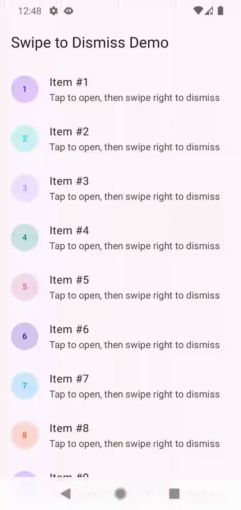

# Swipe-to-Dismiss for Jetpack Navigation 3

iOS-style swipe-to-dismiss navigation for Jetpack Compose Navigation 3.

<p align="center">
  
</p>

## What it demonstrates

- Horizontal swipe gesture to navigate back (drag from left edge or flick right)
- Nested scroll integration — scroll a `LazyColumn` to the top, keep pulling right, and the dismiss gesture kicks in automatically
- Visual feedback during swipe: translation, scale (1.0 → 0.95), alpha fade, progressive corner rounding
- Background parallax effect on the previous screen
- `GraphicsLayer` caching to avoid `movableContentOf` conflicts and freeze position-aware effects (e.g. Haze blur) during the gesture
- Keyboard-aware: first swipe hides the IME, second one starts the dismiss
- Velocity-based dismiss — a fast flick (≥ 1500 dp/s) dismisses regardless of distance
- **Background freeze (opt-in)**: when a foreground is fully opaque and idle, the background's CPU draw, GPU draw and measure pass are skipped while its composition stays alive. Eliminates per-frame work for the hidden screen without tearing down its `LaunchedEffect` / `DisposableEffect` (which would otherwise misbehave on every foreground touch — e.g. clearing focus and dismissing the IME).

## One-line API

```kotlin
swipeToDismissHorizontalEntry<DetailKey> { key -> DetailScreen(key) }

// Opt-in background freeze (skip draw + measure for the hidden screen):
swipeToDismissHorizontalEntry<DetailKey>(freezeBackgroundWhileIdle = true) { key ->
    DetailScreen(key)
}
```

## Architecture

```
swipe/
├── SwipeToDismissSceneStrategy.kt   — SceneStrategy that intercepts marked entries
├── SwipeToDismissScene.kt           — Scene rendering two entries (background + foreground)
├── SwipeToDismissLayout.kt          — Core composable: gesture, animation, GraphicsLayer caching
├── SwipeToDismissEntry.kt           — DSL extension for one-line entry registration
├── FreezeDuringSwipeToDismiss.kt    — Modifier to freeze position-aware effects during swipe
└── FreezeBackgroundWhileIdle.kt     — Metadata helper for the opt-in background freeze flag
```

## Background freeze (`freezeBackgroundWhileIdle`)

When the foreground entry is fully opaque and covers the screen, the background entry is doing useful composition work but its **draw is invisible**. Setting `freezeBackgroundWhileIdle = true` on a `swipeToDismissHorizontalEntry` skips:

| Phase | What is skipped while RESUMED + idle + fully covered |
|---|---|
| CPU draw (`record`) | display-list issuance for the background subtree |
| GPU draw (`drawLayer`) | layer playback in the backbuffer |
| Measure / Layout | children of the background are not measured |

What is **not** dropped: composition. `LaunchedEffect`, `DisposableEffect` and state holders of the background remain alive across foreground touches. This avoids a class of regressions where re-creating the background subtree on every `awaitFirstDown` re-fires window-scoped side effects (e.g. `focusManager.clearFocus()`) and breaks foreground UX (input focus, IME, snackbar host).

Invariants:
- Foreground must be opaque and full-screen — semi-transparent foregrounds will see a black background while idle.
- Background size-aware callbacks (`onSizeChanged`, `onGloballyPositioned`, `onPlaced`) must guard against zero size to remain idempotent across measure-skip cycles.

The demo in this repo uses `freezeBackgroundWhileIdle = true` on `DetailKey`, with a `LaunchedEffect { focusManager.clearFocus() }` in `HomeScreen` and a `TextField` in `DetailScreen`. With the always-compose implementation the keyboard stays open between taps; a legacy drop-from-composition freeze would dismiss it on every tap.

## How it works

1. Mark a navigation entry with `SwipeToDismissSceneStrategy.enabled()` metadata (or use the `swipeToDismissHorizontalEntry` DSL)
2. `SwipeToDismissSceneStrategy` intercepts the entry and creates a `SwipeToDismissScene` with two layers: the previous screen (background) and the current screen (foreground)
3. `SwipeToDismissLayout` handles the drag gesture, animates the foreground off-screen on dismiss, and calls `onBack` to pop the back stack

## Setup

```kotlin
NavDisplay(
    backStack = backStack,
    onBack = { backStack.removeLast() },
    sceneStrategy = SwipeToDismissSceneStrategy() then SinglePaneSceneStrategy(),
    entryProvider = entryProvider {
        entry<HomeKey> { HomeScreen() }
        swipeToDismissHorizontalEntry<DetailKey> { key -> DetailScreen(key) }
    },
)
```

## Dependencies

- `androidx.navigation3:navigation3-runtime:1.0.0`
- `androidx.navigation3:navigation3-ui:1.0.0`
- Jetpack Compose (UI, Animation, Foundation, Material 3)
